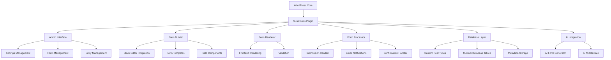
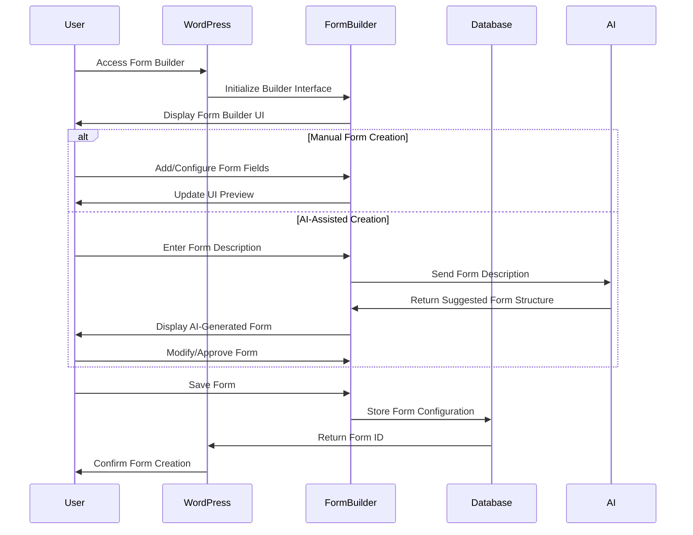
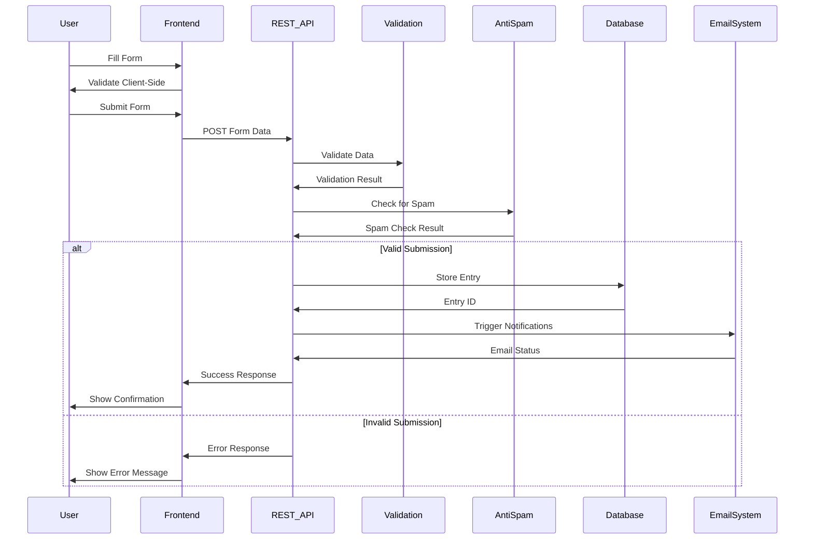
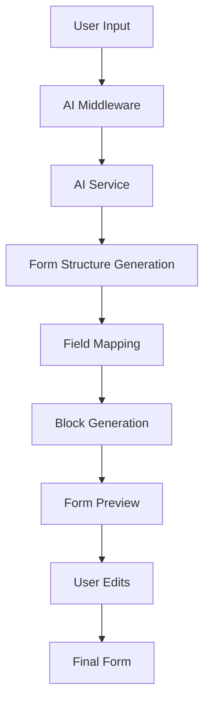
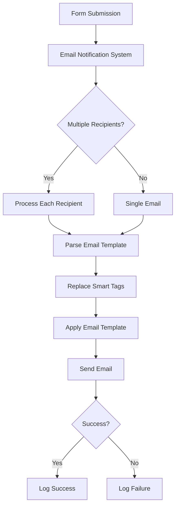

# SureForms Architecture Documentation

## Table of Contents

1. [Introduction](#introduction)
2. [System Architecture](#system-architecture)
3. [Core Components](#core-components)
4. [Data Flow](#data-flow)
5. [Form Building Process](#form-building-process)
6. [AI Integration](#ai-integration)
7. [Form Submission and Processing](#form-submission-and-processing)
8. [Security Features](#security-features)
9. [Extension Points](#extension-points)
10. [Technical Debt and Improvement Areas](#technical-debt-and-improvement-areas)
11. [Development Guidelines](#development-guidelines)

## Introduction

SureForms is a modern WordPress form builder plugin designed to provide an intuitive, no-code form building experience. It leverages WordPress's native block editor (Gutenberg) to create a seamless form building experience that integrates naturally with the WordPress ecosystem.

### Key Features

- **Native WordPress Integration**: Built on top of the WordPress block editor
- **AI-Powered Form Generation**: Create forms quickly using AI suggestions
- **No-Code Flexibility**: Advanced features without requiring coding knowledge
- **Mobile-First Design**: Responsive forms that work across all devices
- **Modern UI/UX**: Clean, intuitive interface for both admins and users
- **Security Features**: Anti-spam protection, GDPR compliance, and data security
- **Extensibility**: Developer-friendly architecture with hooks and filters

## System Architecture

SureForms follows a modular architecture pattern, separating concerns into distinct components that interact through well-defined interfaces.



## Core Components

### Plugin Loader (`Plugin_Loader`)

The central initialization class that bootstraps the plugin, registers hooks, and loads core components. It follows a singleton pattern to ensure only one instance exists.

### Post Types (`Post_Types`)

Registers and manages custom post types for forms and entries. Handles the admin UI customizations for these post types.

### Form Submit (`Form_Submit`)

Processes form submissions through REST API endpoints, validates input data, handles file uploads, processes anti-spam measures, and triggers email notifications.

### AI Form Builder (`AI_Form_Builder`)

Integrates with AI services to generate form structures based on user prompts. Communicates with middleware services to process AI requests.

### Database Layer

Custom database tables for storing form entries and related data, separate from the WordPress post tables for better performance and data organization.

### Frontend Assets (`Frontend_Assets`)

Manages the loading of CSS and JavaScript assets for the frontend rendering of forms.

### Email Notifications

Handles the sending of email notifications based on form submissions, with support for multiple notification templates and recipients.

## Data Flow

### Form Creation Flow



### Form Submission Flow



## Form Building Process

SureForms uses WordPress's block editor as the foundation for its form builder. This approach provides several advantages:

1. **Familiar Interface**: Users already familiar with WordPress's editor can easily adapt
2. **Native Integration**: Seamless integration with WordPress core functionality
3. **Extensibility**: Ability to leverage the block ecosystem

### Block Structure

Forms are composed of various block types:

- **Container Blocks**: Group and organize form fields
- **Field Blocks**: Individual form inputs (text, email, checkbox, etc.)
- **Layout Blocks**: Control the visual arrangement of fields
- **Special Blocks**: Submit buttons, GDPR notices, etc.

Each block has its own edit and save components, following the WordPress block API pattern.

### Form Data Storage

Form configurations are stored as custom post types with:

- Post content: Stores the block structure (serialized blocks)
- Post meta: Stores form settings, styling options, and other configuration data

## AI Integration

SureForms features an AI-powered form generation system that allows users to create forms by describing them in natural language.



### AI Form Generation Process

1. User provides a description of the desired form
2. The description is sent to the AI middleware
3. AI analyzes the description and generates a structured form definition
4. The form definition is mapped to SureForms field types
5. Blocks are generated and inserted into the editor
6. User can review and modify the generated form

## Form Submission and Processing

### Submission Handling

Form submissions are processed through a custom REST API endpoint that:

1. Validates the form data against defined rules
2. Checks for spam using various methods (honeypot, reCAPTCHA, etc.)
3. Processes file uploads if present
4. Stores the submission in the database
5. Triggers email notifications
6. Returns appropriate success/error responses

### Email Notifications

The email notification system supports:

- Multiple notification templates per form
- Dynamic content using smart tags
- HTML email formatting
- Conditional sending based on form data
- Custom headers (CC, BCC, Reply-To)



## Security Features

SureForms implements multiple security measures to protect against common vulnerabilities:

### Anti-Spam Protection

- **Honeypot Fields**: Hidden fields to catch automated submissions
- **reCAPTCHA Integration**: Multiple versions of Google reCAPTCHA
- **hCaptcha Support**: Alternative to reCAPTCHA
- **Cloudflare Turnstile**: Modern CAPTCHA alternative

### Data Protection

- **GDPR Compliance**: Options to enable GDPR-compliant data handling
- **Data Encryption**: Sensitive data can be encrypted in storage
- **Auto-Delete Entries**: Automatic deletion of entries after a specified period

### Input Validation

- **Client-Side Validation**: Immediate feedback to users
- **Server-Side Validation**: Thorough validation of all submitted data
- **File Upload Security**: Strict file type and size validation

## Extension Points

SureForms provides several extension points for developers:

### WordPress Hooks

```php
// Example of filter hook for email notification
add_filter('srfm_email_notification', function($parsed, $submission_data, $item, $form_data) {
    // Modify email content or recipients
    return $parsed;
}, 10, 4);

// Example of action hook before form submission
add_action('srfm_before_submission', function($form_data) {
    // Perform custom actions before form processing
});
```

### JavaScript API

```javascript
// Example of extending the form validation
window.sureFormsHooks.addFilter(
    'srfm.validation.rules',
    'my-plugin/custom-validation',
    function(rules, fieldData) {
        // Add custom validation rules
        return rules;
    }
);
```

## Technical Debt and Improvement Areas

1. **Performance Optimization**:
   - Lazy loading of form assets
   - Improved caching strategies

2. **Code Refactoring**:
   - Further modularization of components
   - Consistent naming conventions

3. **Testing Coverage**:
   - Increase unit and integration test coverage
   - Automated UI testing

## Development Guidelines

### Coding Standards

SureForms follows WordPress coding standards with some additional guidelines:

- PHP: PSR-12 with WordPress-specific adaptations
- JavaScript: ESLint with WordPress configuration
- CSS: Follows WordPress CSS coding standards

### Development Workflow

1. **Feature Planning**: Document requirements and design
2. **Development**: Implement features with appropriate tests
3. **Code Review**: Peer review for quality assurance
4. **Testing**: Automated and manual testing
5. **Documentation**: Update technical and user documentation
6. **Release**: Version tagging and deployment

### Version Control

- Feature branches for new development
- Pull request workflow for code review
- Semantic versioning for releases

## Conclusion

SureForms represents a modern approach to WordPress form building, combining the power of the block editor with advanced features like AI form generation. Its modular architecture and extensive extension points make it both user-friendly and developer-friendly, while its focus on security and performance ensures a reliable experience for all users.

The plugin continues to evolve with a focus on improving user experience, expanding integration capabilities, and optimizing performance across all devices and platforms.
