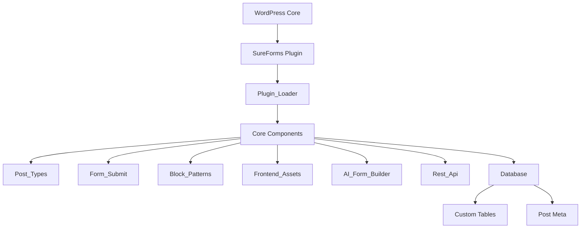
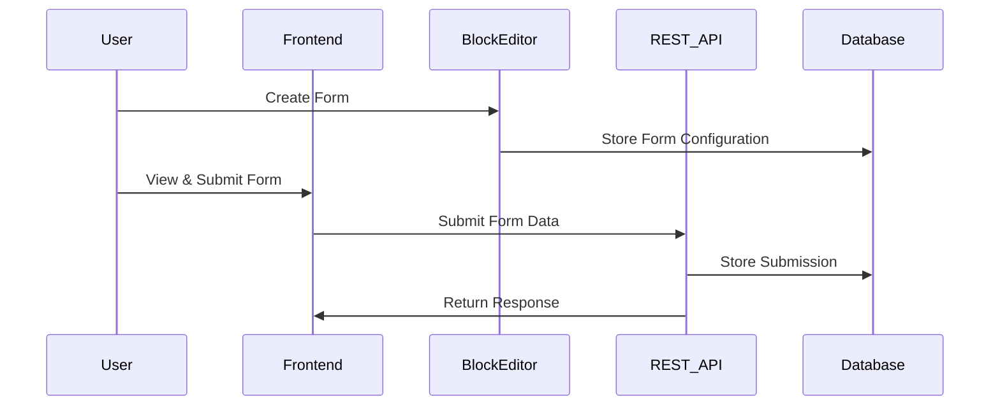
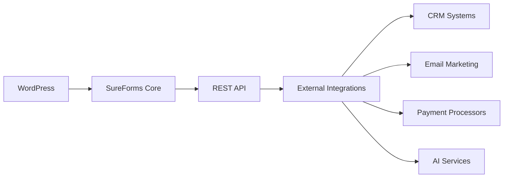

# SureForms: Comprehensive Analysis

This document provides a multi-perspective analysis of the SureForms WordPress plugin, examining it from software architecture, development, and product management viewpoints.

## Table of Contents

1. [Software Architecture Analysis](#software-architecture-analysis)
2. [Development Perspective](#development-perspective)
3. [Product Management Analysis](#product-management-analysis)
4. [Integration Capabilities](#integration-capabilities)
5. [Future Development Roadmap](#future-development-roadmap)

## Software Architecture Analysis

### Core Architecture

SureForms follows a modular architecture pattern with clear separation of concerns. The plugin is built around several key components:

The architecture leverages WordPress's plugin system and follows object-oriented principles with extensive use of the singleton pattern for core components.

### Data Flow Architecture

The data flow within SureForms follows a clear pattern:

This separation ensures clean data handling and allows for extensibility at various points in the process.

### Component Analysis

#### Plugin Loader

The `Plugin_Loader` class serves as the entry point for the plugin, handling initialization, autoloading, and hook registration. It follows the singleton pattern to ensure only one instance exists.

#### Post Types

The `Post_Types` class manages custom post types for forms and entries, including admin UI customizations, shortcode functionality, and metadata registration.

#### Form Submit

The `Form_Submit` class processes form submissions through REST API endpoints, handling validation, file uploads, anti-spam measures, and email notifications.

#### Database Layer

SureForms uses both WordPress custom post types and custom database tables:
- Custom post type `sureforms_form` for form configurations
- Custom table `{prefix}_srfm_entries` for form submissions

This hybrid approach leverages WordPress's content management for forms while optimizing data storage for submissions.

#### AI Integration

The AI form builder component connects with external AI services through a middleware layer, translating natural language descriptions into structured form definitions.

### Technical Debt Assessment

Current areas of technical debt include:

1. **Performance Optimization**
   - Opportunity for more aggressive asset loading strategies
   - Potential for improved caching mechanisms

2. **Code Organization**
   - Some components have grown large and could benefit from further modularization
   - Inconsistent naming conventions in some areas

3. **Testing Coverage**
   - Limited automated testing for JavaScript components
   - Opportunity for more comprehensive integration tests

## Development Perspective

### Code Quality

The codebase demonstrates several positive qualities:

- **Consistent Structure**: Well-organized directory structure
- **Modern Practices**: Use of namespaces, autoloading, and OOP principles
- **Documentation**: Comprehensive inline documentation
- **Separation of Concerns**: Clear boundaries between components

Areas for improvement include:

- **Testing Coverage**: Expanding unit and integration tests
- **Consistent Naming**: Standardizing naming conventions across all components
- **Performance Profiling**: Identifying and addressing performance bottlenecks

### Development Workflow

The development process appears to follow modern practices:

- **Version Control**: Git-based workflow with feature branches
- **Code Review**: Evidence of peer review processes
- **Continuous Integration**: GitHub Actions for automated testing
- **Semantic Versioning**: Clear versioning strategy

### Extension Points

SureForms provides several extension mechanisms:

1. **WordPress Hooks**
   - Actions for process intervention
   - Filters for data modification

2. **JavaScript API**
   - Client-side hooks for extending functionality
   - Custom events for integration

3. **Block API**
   - Ability to register custom form field blocks
   - Block filters for modifying existing blocks

4. **Template System**
   - Customizable templates for form rendering
   - Theme override capabilities

### Technology Stack

The plugin leverages a modern technology stack:

- **PHP**: Core server-side logic
- **JavaScript/React**: Block editor integration and frontend functionality
- **CSS/SCSS**: Styling with preprocessor support
- **MySQL**: Database storage
- **REST API**: Data communication
- **AI Services**: Form generation capabilities

## Product Management Analysis

### User Segments

SureForms targets several distinct user segments:

1. **Website Owners**
   - Need: Simple form creation without technical knowledge
   - Value: Intuitive interface, pre-designed templates

2. **Designers**
   - Need: Visually appealing forms that match site design
   - Value: Design customization, aesthetic controls

3. **Developers**
   - Need: Extensible platform with clean APIs
   - Value: Hooks, filters, and documentation

4. **No-Code Professionals**
   - Need: Advanced functionality without coding
   - Value: Conditional logic, multi-step forms

### Feature Analysis

The feature set is well-aligned with user needs:

| Feature | User Segment | Value Proposition |
|---------|--------------|-------------------|
| Block Editor Integration | All | Familiar, native WordPress experience |
| AI Form Generation | All | Rapid form creation with minimal effort |
| Mobile-First Design | All | Forms work well on all devices |
| Advanced Field Types | No-Code Professionals | Complex form capabilities without coding |
| Developer Hooks | Developers | Extensibility for custom needs |
| Visual Customization | Designers | Forms match site aesthetics |
| Anti-Spam Features | All | Protection from spam submissions |
| GDPR Compliance | All | Legal compliance and data protection |

### Competitive Positioning

SureForms differentiates itself through:

1. **Native WordPress Integration**: Using the block editor rather than a custom interface
2. **AI-Powered Creation**: Faster form building through AI assistance
3. **Design Focus**: Emphasis on visual appeal and user experience
4. **Developer-Friendly**: Clean architecture and extension points

### Market Fit

The product demonstrates strong market fit by addressing several key pain points:

1. **Complex Form Building**: Simplifying the process through AI and intuitive interface
2. **Design Limitations**: Providing modern styling out-of-the-box
3. **Mobile Responsiveness**: Ensuring forms work well on all devices
4. **Technical Barriers**: Enabling advanced features without coding requirements

## Integration Capabilities

### WordPress Ecosystem

SureForms integrates well with the WordPress ecosystem:

- **Themes**: Compatible with major themes including Astra, Kadence, GeneratePress
- **Page Builders**: Works with Elementor, Beaver Builder, Divi
- **Plugins**: Compatible with popular plugins like WooCommerce, Easy Digital Downloads

### External Services

The plugin offers integration with several external services:

- **reCAPTCHA**: Anti-spam protection
- **hCaptcha**: Alternative CAPTCHA solution
- **Cloudflare Turnstile**: Modern CAPTCHA alternative
- **AI Services**: Form generation capabilities

### API Architecture

The API architecture facilitates integration:

This architecture allows for flexible integration with various third-party services.

## Future Development Roadmap

Based on the analysis, several development priorities emerge:

### Short-Term Priorities

1. **Performance Optimization**
   - Implement lazy loading for form assets
   - Optimize database queries for large form submissions

2. **Code Quality Improvements**
   - Increase test coverage
   - Standardize naming conventions
   - Refactor larger components

3. **Integration Expansion**
   - Add more third-party service integrations
   - Enhance existing integrations with deeper functionality

### Medium-Term Priorities

1. **Advanced AI Capabilities**
   - Improve form generation accuracy
   - Add form analytics and insights

2. **Enhanced User Experience**
   - Streamline the form building process
   - Improve form submission handling

3. **Developer Tools**
   - Create comprehensive API documentation
   - Develop example extensions

### Long-Term Vision

1. **Form Ecosystem**
   - Develop a marketplace for extensions
   - Create specialized form solutions for different industries

2. **Enterprise Features**
   - Advanced workflow automation
   - Enhanced security and compliance features

3. **SaaS Potential**
   - Explore hosted form solution alongside WordPress plugin
   - Develop cloud-based form management

## Conclusion

SureForms represents a modern approach to WordPress form building, combining native block editor integration with AI-powered form generation. Its architecture demonstrates good separation of concerns and extensibility, while its feature set addresses key user needs across multiple segments.

The product is well-positioned in the competitive form builder market, with clear differentiation through its WordPress integration, AI capabilities, and design focus. Future development should focus on expanding integrations, enhancing AI capabilities, and improving performance to maintain this competitive advantage.

From a technical perspective, the codebase is well-structured but would benefit from increased test coverage and some refactoring of larger components. The extension system provides good flexibility for developers, though more comprehensive documentation would enhance this further.

Overall, SureForms shows strong potential for continued growth and adoption, particularly as the WordPress ecosystem continues to embrace the block editor and AI-powered tools become increasingly important in the website building process.
