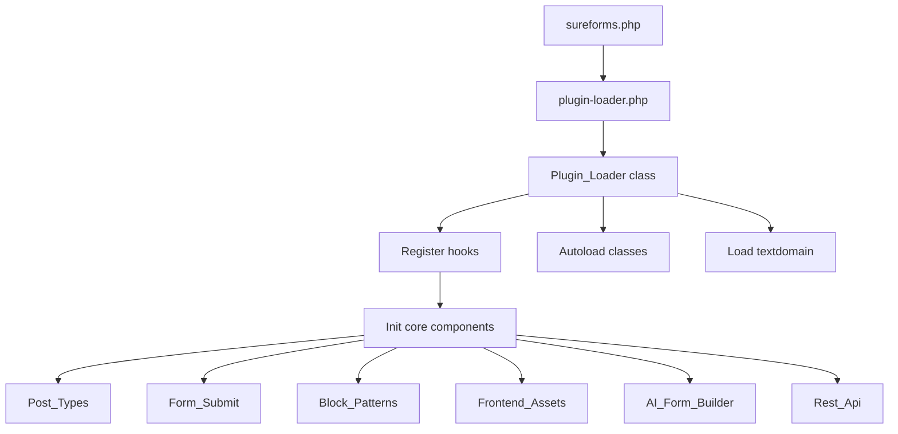
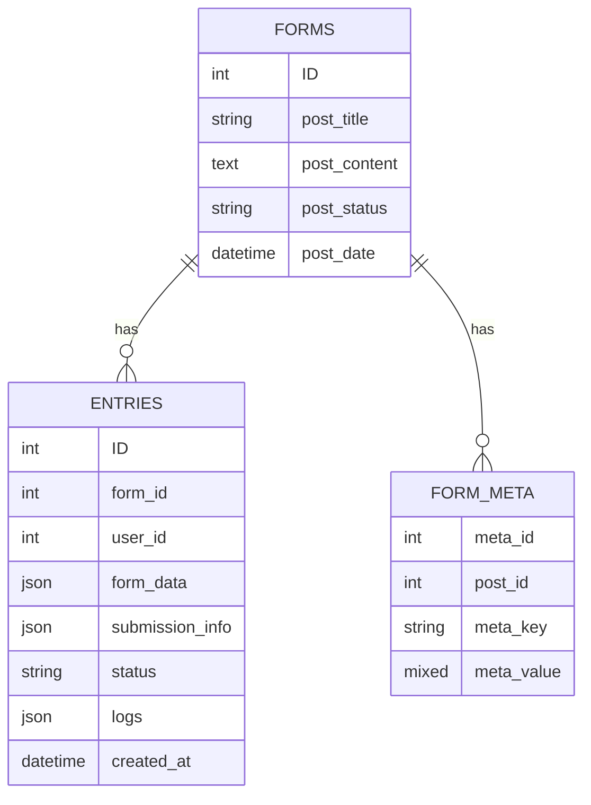
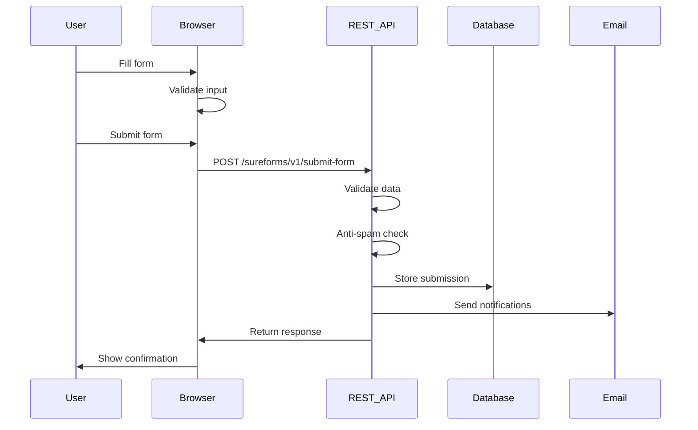

# SureForms Technical Overview

## Introduction

SureForms is a modern WordPress form builder plugin that leverages the native WordPress block editor (Gutenberg) to provide an intuitive, no-code form building experience. This document provides a comprehensive technical overview of the plugin's architecture, components, and functionality.

## Table of Contents

1. [Plugin Architecture](#plugin-architecture)
2. [Core Components](#core-components)
3. [Database Structure](#database-structure)
4. [Form Building System](#form-building-system)
5. [Form Submission Process](#form-submission-process)
6. [AI Integration](#ai-integration)
7. [Security Features](#security-features)
8. [Extension Points](#extension-points)
9. [Performance Considerations](#performance-considerations)
10. [Future Development](#future-development)

## Plugin Architecture

SureForms follows a modular architecture pattern with clear separation of concerns. The plugin is structured around several key components that interact through well-defined interfaces.

### Directory Structure

```
sureforms/
├── admin/                  # Admin-specific functionality
├── api/                    # REST API endpoints
├── assets/                 # CSS, JS, and other assets
├── inc/                    # Core functionality
│   ├── ai-form-builder/    # AI form generation
│   ├── blocks/             # Block registration
│   ├── compatibility/      # Theme/plugin compatibility
│   ├── database/           # Custom database tables
│   ├── email/              # Email notification system
│   ├── fields/             # Form field definitions
│   ├── global-settings/    # Global plugin settings
│   ├── lib/                # Third-party libraries
│   ├── page-builders/      # Page builder integrations
│   ├── single-form-settings/ # Form-specific settings
│   └── traits/             # Shared PHP traits
├── languages/              # Internationalization files
├── modules/                # Feature modules
│   ├── gutenberg/          # Gutenberg integration
│   └── quick-action-sidebar/ # Quick action UI
├── src/                    # JavaScript source files
│   ├── admin/              # Admin JS
│   ├── blocks/             # Block JS
│   ├── components/         # Reusable React components
│   ├── lib/                # JS libraries
│   ├── store/              # Redux store
│   ├── styles/             # SCSS files
│   └── utils/              # Utility functions
└── templates/              # Template files
```

### Initialization Flow

The plugin follows a structured initialization process:

1. `sureforms.php` - Main plugin file that defines constants and includes the plugin loader
2. `plugin-loader.php` - Initializes the plugin and registers core components
3. Core components are loaded through the `Plugin_Loader` class using autoloading
4. WordPress hooks are registered to integrate with the WordPress lifecycle



## Core Components

### Plugin_Loader

The central initialization class that bootstraps the plugin, registers hooks, and loads core components. It follows a singleton pattern to ensure only one instance exists.

```php
class Plugin_Loader {
    private static $instance = null;
    
    public static function get_instance() {
        if (null === self::$instance) {
            self::$instance = new self();
            do_action('srfm_core_loaded');
        }
        return self::$instance;
    }
    
    // Initialization methods...
}
```

### Post_Types

Registers and manages custom post types for forms and entries. Handles the admin UI customizations for these post types.

Key features:
- Registers `sureforms_form` post type for storing form configurations
- Adds custom columns to the admin list view
- Implements shortcode functionality
- Manages form metadata registration

### Form_Submit

Processes form submissions through REST API endpoints, validates input data, handles file uploads, processes anti-spam measures, and triggers email notifications.

Key features:
- Registers `/sureforms/v1/submit-form` REST API endpoint
- Validates form submissions against defined rules
- Processes file uploads with security checks
- Handles anti-spam measures (honeypot, reCAPTCHA, hCaptcha, Cloudflare Turnstile)
- Stores submissions in the database
- Triggers email notifications

### AI_Form_Builder

Integrates with AI services to generate form structures based on user prompts. Communicates with middleware services to process AI requests.

Key features:
- Processes natural language descriptions into form structures
- Maps AI-generated fields to SureForms field types
- Generates block structures for the editor

## Database Structure

SureForms uses both WordPress custom post types and custom database tables to store data efficiently.

### Custom Post Types

- **sureforms_form**: Stores form configurations
  - Post content: Serialized blocks representing the form structure
  - Post meta: Form settings, styling options, and other configuration data

### Custom Database Tables

- **{prefix}_srfm_entries**: Stores form submissions
  - ID: Primary key
  - form_id: Associated form ID
  - user_id: Submitter's user ID (if logged in)
  - form_data: JSON-encoded submission data
  - submission_info: Browser, IP, and device information
  - status: Entry status (read, unread, trash)
  - logs: Activity logs for the entry
  - created_at: Submission timestamp



## Form Building System

SureForms uses WordPress's block editor as the foundation for its form builder.

### Block Structure

Forms are composed of various block types:

- **Container Blocks**: Group and organize form fields
- **Field Blocks**: Individual form inputs (text, email, checkbox, etc.)
- **Layout Blocks**: Control the visual arrangement of fields
- **Special Blocks**: Submit buttons, GDPR notices, etc.

Each block has its own edit and save components, following the WordPress block API pattern.

### Block Registration

Blocks are registered using the WordPress block registration API:

```javascript
registerBlockType('sureforms/input', {
    title: __('Text Field', 'sureforms'),
    icon: 'text',
    category: 'sureforms',
    attributes: {
        // Block attributes
    },
    edit: Edit,
    save: Save
});
```

### Form Rendering

Forms are rendered on the frontend using a combination of server-side rendering and client-side JavaScript:

1. The form shortcode or block triggers the `Generate_Form_Markup::get_form_markup()` method
2. The method retrieves the form configuration and generates the HTML markup
3. Frontend JavaScript initializes the form functionality (validation, submission, etc.)

## Form Submission Process

### Client-Side Flow

1. User fills out the form
2. Client-side validation checks for errors
3. Form data is collected and serialized
4. AJAX request is sent to the REST API endpoint
5. Response is processed and appropriate feedback is shown to the user

### Server-Side Flow

1. REST API endpoint receives the form submission
2. Data is validated and sanitized
3. Anti-spam checks are performed
4. If GDPR compliance is enabled, appropriate data handling is applied
5. Submission is stored in the database (unless configured not to)
6. Email notifications are triggered
7. Response is sent back to the client



## AI Integration

SureForms features an AI-powered form generation system that allows users to create forms by describing them in natural language.

### AI Form Generation Process

1. User provides a description of the desired form
2. The description is sent to the AI middleware
3. AI analyzes the description and generates a structured form definition
4. The form definition is mapped to SureForms field types
5. Blocks are generated and inserted into the editor
6. User can review and modify the generated form

### AI Middleware

The AI middleware acts as a bridge between SureForms and the AI service:

1. Receives the form description from SureForms
2. Processes the description using AI models
3. Returns a structured form definition
4. Handles authentication and rate limiting

## Security Features

SureForms implements multiple security measures to protect against common vulnerabilities:

### Anti-Spam Protection

- **Honeypot Fields**: Hidden fields to catch automated submissions
- **reCAPTCHA Integration**: Multiple versions of Google reCAPTCHA
- **hCaptcha Support**: Alternative to reCAPTCHA
- **Cloudflare Turnstile**: Modern CAPTCHA alternative

### Data Protection

- **GDPR Compliance**: Options to enable GDPR-compliant data handling
- **Data Encryption**: Sensitive data can be encrypted in storage
- **Auto-Delete Entries**: Automatic deletion of entries after a specified period

### Input Validation

- **Client-Side Validation**: Immediate feedback to users
- **Server-Side Validation**: Thorough validation of all submitted data
- **File Upload Security**: Strict file type and size validation

## Extension Points

SureForms provides several extension points for developers:

### WordPress Hooks

```php
// Example of filter hook for email notification
add_filter('srfm_email_notification', function($parsed, $submission_data, $item, $form_data) {
    // Modify email content or recipients
    return $parsed;
}, 10, 4);

// Example of action hook before form submission
add_action('srfm_before_submission', function($form_data) {
    // Perform custom actions before form processing
});
```

### JavaScript API

```javascript
// Example of extending the form validation
window.sureFormsHooks.addFilter(
    'srfm.validation.rules',
    'my-plugin/custom-validation',
    function(rules, fieldData) {
        // Add custom validation rules
        return rules;
    }
);
```

## Performance Considerations

SureForms is designed with performance in mind:

### Asset Loading

- CSS and JavaScript assets are loaded only when needed
- Assets are minified and optimized for production
- Critical CSS is inlined for faster rendering

### Database Optimization

- Custom database tables with appropriate indexes
- Efficient queries with proper WHERE clauses
- Caching of frequently accessed data

### Form Rendering

- Server-side rendering for initial form display
- Progressive enhancement for JavaScript features
- Lazy loading of heavy components

## Future Development

Planned enhancements for future versions:

1. **Enhanced AI Capabilities**
   - More sophisticated form generation
   - AI-powered form analytics

2. **Advanced Integrations**
   - More third-party service integrations
   - Improved CRM connections

3. **Performance Optimizations**
   - Further asset optimization
   - Enhanced caching strategies

4. **Accessibility Improvements**
   - Better screen reader support
   - Keyboard navigation enhancements

5. **Developer Tools**
   - More comprehensive API documentation
   - Additional extension points

## Conclusion

SureForms represents a modern approach to WordPress form building, combining the power of the block editor with advanced features like AI form generation. Its modular architecture and extensive extension points make it both user-friendly and developer-friendly, while its focus on security and performance ensures a reliable experience for all users.
